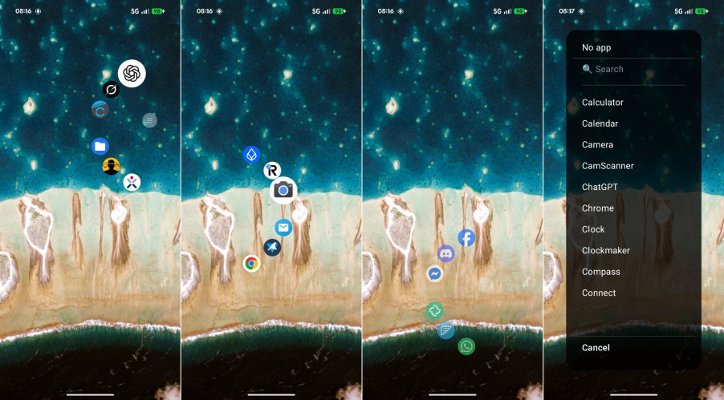

# PieLauncher

> **A launcher built around muscle memory instead of icons.**

PieLauncher replaces the traditional Android home screen with a radial launcher that appears exactly where your finger touches the display.

Instead of searching pages of icons, you launch apps through a small set of fixed gestures that quickly become muscle memory.

The goal is not to provide hundreds of features.

The goal is to make launching your most-used apps as fast and effortless as possible.

---

<p align="center">
  
</p>

## Philosophy

Most Android launchers optimize for discovering apps.

PieLauncher optimizes for remembering them.

Instead of:

- Unlocking your phone
- Searching a page of icons
- Visually locating an app
- Tapping it

You simply:

- Touch the screen
- Move your thumb in a direction
- Release

After a few days, launching your favorite apps becomes automatic.

No searching.

No thinking.

Just muscle memory.

---

## Features

- 🎯 Radial (Pie) launcher
- 👆 One-handed operation
- 📱 Three independent profiles
- 🧭 Six configurable app slots per profile
- ✏️ Long-press editing
- ➕ Add, replace and remove apps
- 🔍 Searchable app drawer
- 💾 Persistent configuration
- ⚡ Built with Jetpack Compose

---

## How it Works

Touch anywhere on the screen and drag.

A pie menu appears centered under your finger with up to 6 app slots arranged in a fan pattern.

Move your finger toward one of the app slots.

Release to launch the selected app.

### Profiles

The launcher has **three independent profiles** that automatically switch based on where you touch:

- **Top profile** (upper 45% of screen)
- **Middle profile** (45% - 70% of screen)  
- **Bottom profile** (lower 30% of screen)

Each profile can hold 6 different apps, giving you quick access to 18 apps total.

### Editing Apps

- **Long press on an app slot** (2.5 seconds) to edit or remove that app
- **Long press in the center** (2.5 seconds) to open the app drawer
- **Tap the center button** to open the app drawer immediately
- In the app drawer, tap **"Wallpaper"** to change your wallpaper
- Use the search bar to quickly find apps

### Layout

The pie menu automatically adjusts based on which side of the screen you touch:

- Touch **left side** → Left-handed layout
- Touch **right side** → Right-handed layout

---

## Why Another Launcher?

Traditional launchers are visual.

PieLauncher is spatial.

Instead of remembering where an icon is located on a page, your brain learns directions.

For example:

- Signal → top-right
- Camera → bottom
- Browser → left

Eventually you stop looking entirely.

The launcher becomes almost invisible.

---

## Current Status

PieLauncher is fully functional and used as a daily launcher.

### Implemented

- App launching
- Three independent profiles
- Long-press editing
- Add / Replace / Remove apps
- Searchable app drawer
- Persistent configuration
- Wallpaper picker


### Planned

- Profile switching indicators
- Customizable app slot count
- Backup / Restore configuration
- Settings screen
- Performance improvements
- Animations and polish
- Gesture customization

---

## Building

Clone the repository:

```bash
git clone https://github.com/se7en-x230/PieLauncher.git
cd PieLauncher
```

Install on a connected device:

```bash
./gradlew installDebug
```

---

## Download

The latest development APK is available in the `apk/` directory.
https://github.com/se7en-x230/PieLauncher/tree/main/apk

---

## Contributing

The project intentionally stays small.

The priorities are:

- Simplicity
- Speed
- Clean architecture
- Excellent UX

Large feature additions are less interesting than making the launcher feel instant.

Bug reports, ideas and pull requests are always welcome.

---

## Vision

PieLauncher is an experiment.

Can launching apps become pure muscle memory?

After using it daily for several months, I believe the answer is **yes**.

---

## License

MIT License
